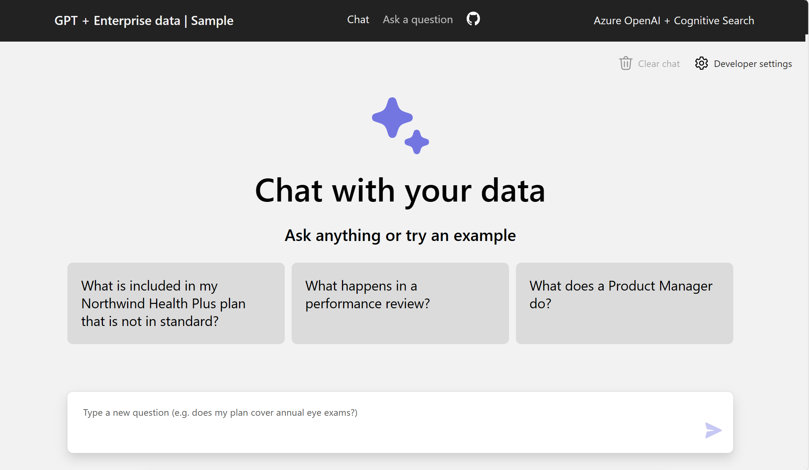

[View Demo](https://app-backend-44yscpoyifz6q.azurewebsites.net/){: .btn .btn--primary}
<br>
__Guide:__ Using chat to search enterprise knowledge base from pre-provided PDF documents<br>
__Technology:__ OpenAI ChatGPT+Azure Cognitive Search<br>
__Installing Prerequisites with Chocolatey__: [video](https://youtu.be/yDxaXcSMP9o)

You can access [Source Code](https://aka.ms/entGPTSearch) to deploy and customize your own application

## Video Walkthrough
<iframe width="640" height="360" src="https://www.youtube-nocookie.com/embed/TxzvpFWoWCE?controls=0" frameborder="0" allowfullscreen></iframe>


## FAQ
Please refer to [repo FAQ](https://github.com/Azure-Samples/azure-search-openai-demo#faq)
<BR>
Additional Points:
1. If you cannot find your subscription when running `azd up`, please try login with tenant id<br>
```
azd auth login --tenant-id [tenant id]
```
<br>
2. pip install error when running prepdocs.ps1<br>
Double check with running the following command
```
./scripts/.venv/Scripts/activate
pip install openai
```
It is due to one of the dependency aiohttp is not compatible with python 3.11 or above. Please use python 3.9 or 3.10.<br>
reference: [https://github.com/aio-libs/aiohttp/issues/7051](https://github.com/aio-libs/aiohttp/issues/7051)
<br>
3. Cannot use Ask a Question Read-Retrive-Read or Read-Decompose-Ask approaches<br>
Langchain conenction broken after upgrading to useAzure OpenAI gpt-turbo-35 0613 version. Need to wait for update on if these 2 approaches will continue to be supported.<br>
reference: [https://github.com/Azure-Samples/azure-search-openai-demo/pull/738](https://github.com/Azure-Samples/azure-search-openai-demo/pull/738)


## Other Language supports
There are other language supporting for the sample.<BR>
Some of them are still in development and support less festures.<BR>

### C#
[Source Code](https://github.com/Azure-Samples/azure-search-openai-demo-csharp)
Hosting on Azure Container Apps<BR>
<BR>
### Java
[Source Code](https://github.com/Azure-Samples/azure-search-openai-demo-java)
Hosted on Azure App Service <BR>
Focus on showcase different options to implement semantic search using RAG patterns with Java, Azure OpenAI and Semantic Kernel.<BR>
<BR>
### javascript
[Source Code](https://github.com/Azure-Samples/azure-search-openai-javascript)
Frontend hosted on Azure Static Web App<BR>
Backend hosted on Azure Container Apps<BR>

## Variations

__Data Manager for Energy__: [Source Code](https://github.com/Azure-Samples/azure-data-manager-for-energy-openai-demo)

